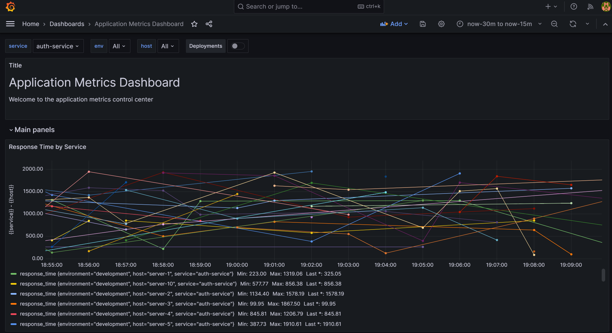

# Real-Time Monitoring Pipeline

This README explains how to bring up the full monitoring stack — Apache NiFi, InfluxDB, Grafana and a Python data-generator—load, start all NiFi processors, and view live metrics in Grafana.

## 📋 Prerequisites

* Docker & Docker Compose installed
* Project directory layout:

```
monitoring-pipeline/
├── docker-compose.yml
├── nifi/
│   └── templates/
│       └── metrics_flow.xml
├── python/
│   ├── Dockerfile
│   ├── requirements.txt
│   └── data_generator.py
└── grafana/
    ├── provisioning/
    └── init/
```

## 1. Build & Start All Services

```bash
docker compose up --build -d
```

* `--build` forces a rebuild of the Python data-generator image.
* `-d` runs containers in detached mode.

Verify all containers are up:

```bash
docker compose ps
```

## 2. Verify NiFi & Load Template

1. **Open NiFi UI** Navigate to:

```
http://localhost:8080/nifi
```

2. **Confirm Template**
   * Click the **Templates** icon (top toolbar)
   * Drag the template onto the canvas
    
   * You should see `metrics_flow.xml` listed
   * (If not, ensure `./nifi/templates` is mounted to `/opt/nifi/nifi-current/conf/templates:ro`)

## 3. Enable Controller Service & Run the Flow

1. **Enable "HandleHttpRequest" Controller Service**
   * Click the gear icon in the **HandleHttpRequest** processor
   * Click on the following arrow next to Http Context Map property
    
   * Find **HttpRequest**, click **Enable**
    

   , click **Apply**
   * Select the background of Nifi and click **Run** (►) to start **all processors**

3. **Verify**
   * Processors turn green, incoming/outgoing counts increment

## 4. Start Data Generator

The Python container will:
* Wait until NiFi's HTTP-listener port (8081) is open
* Generate dummy metrics every 2 seconds
* POST JSON payloads to `http://nifi:8081/metrics`

To watch its output:

```bash
docker compose logs -f data-generator
```

You should see lines like:

```
Waiting for NiFi to open port 8081...
Sent: web-app – 123.45ms
Sent: database – 987.65ms
...
```

## 5. View Metrics in Grafana

1. **Open Grafana UI**

```
http://localhost:3000
```

Default login: **admin / admin**

2. **Load Dashboards** Provisioning auto-imports dashboards connected to InfluxDB "metrics" bucket.

3. **Observe Live Data** Navigate to your dashboard—you'll see real-time graphs for response time, CPU, memory, error rate, etc.




## 🛠 Troubleshooting

* **NiFi startup too slow?** Increase `sleep 120` in the `nifi` service command of `docker-compose.yml`.
* **Template missing in UI?** Verify the volume mount:

```yaml
volumes:
  - ./nifi/templates:/opt/nifi/nifi-current/conf/templates:ro
```

* **Data generator never starts?** Ensure `nc` (netcat) is installed in the Python image and that the service name `nifi` and port `8081` match.
* **InfluxDB/Grafana errors?** Check their logs:

```bash
docker compose logs influxdb
docker compose logs grafana
```

## ✅ Success!

You now have a fully automated, real-time monitoring pipeline up and running! 🎉